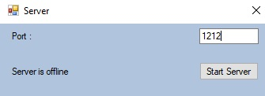
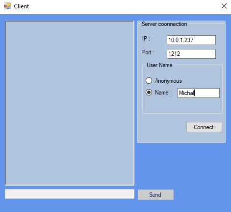
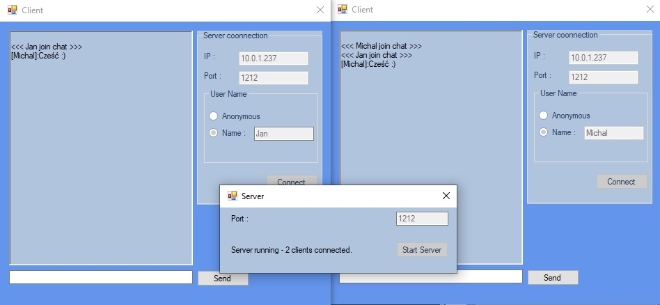

# ChatTCP

Simple text chat based on client server architecture and TCP protocol

Both client and server applications are written in Winforms and support asynchronous

## Server

To start the server you need to enter the port number on which the server should listen to the calls and press the button "Start Server"

## Client

To connect to the server, enter ip, port and optional username 

